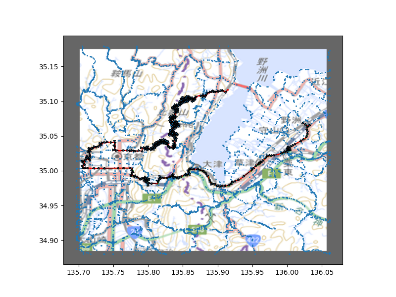

# map analysis


## pyenv
Python 3.7.4

## venv

```
python -m venv venv
source venv/bin/activate
pip install --upgrade pip
pip install -r requirements.txt
```
For vector_tile_base
```
pip install git+https://github.com/mapbox/vector-tile-base.git
```

## データベース
sqlite3を使用。データベースファイルはvectortile.db。<br>
一つのベクトルタイルに対して、全体テーブルおよび、隣接ノード関係テーブルがある。<br>
例えば、経度方向：898、緯度方向405、ズーム：10のベクトルタイルファイルに対して、

* table＿10＿898＿405：全体テーブル
* table＿10＿898＿405_n：nノードの隣接ノード関係テーブル

がある。

### 全体テーブルの構造
例えば、table＿10＿898＿405テーブルに関して

| id | line_id | tile_lat | tile_lon | ratio_lat | ratio_lon | lat | lon | alti | edge | t_lat | t_lat |
| :---: | :---: | :---: | :---: | :---: | :---: | :---: | :---: | :---: | :---: | :---: | :---: |
0|0|-80|21|-0.01953125|0.005126953125|35.1794208217521|135.704927444458|524.16|1|404.98046875|898.005126953125
1|0|-46|34|-0.01123046875|0.00830078125|35.1770355550041|135.706043243408|578.83|0|404.98876953125|898.00830078125
2|0|-36|31|-0.0087890625|0.007568359375|35.1763339926404|135.705785751343|524.16|0|404.9912109375|898.007568359375
3|0|-27|24|-0.006591796875|0.005859375|35.1757025813363|135.705184936523|524.16|0|404.993408203125|898.005859375

* id：ノード番号
* line_id : ライン番号（一つのラインに最低二つ以上のノードが含まれる）
* lat : 緯度
* lon : 経度
* alti : 標高
* edge : 該当のラインの端か否か(0: 端でない、1: 始点、-1: 終点)

その他のカラムに関しては副生成物と考えて良い。

### 隣接ノード関係テーブル
例えば、table＿10＿898＿405_3885テーブルに関して

| id | neighbors | distance | height |
| :---: | :---: | :---: | :---: | :---: |
3885|3881|0.000241352186716464|-0.0700000000000003
3885|3884|1.44225898971387e-05|2.41
3885|3976|4.85238375249803e-05|-3.08

* id：ノード番号
* neighbors : 隣接ノード
* distance : 隣接ノードとの距離。x = 経度、y = 緯度とした場合のEuclid距離
* height : 隣接ノードとの標高差（隣接ノードの標高ー該当ノードの標高）

## Reference
* https://maps.gsi.go.jp/development/tileCoordCheck.html#13/34.9877/135.8135
* https://maps.gsi.go.jp/development/ichiran.html